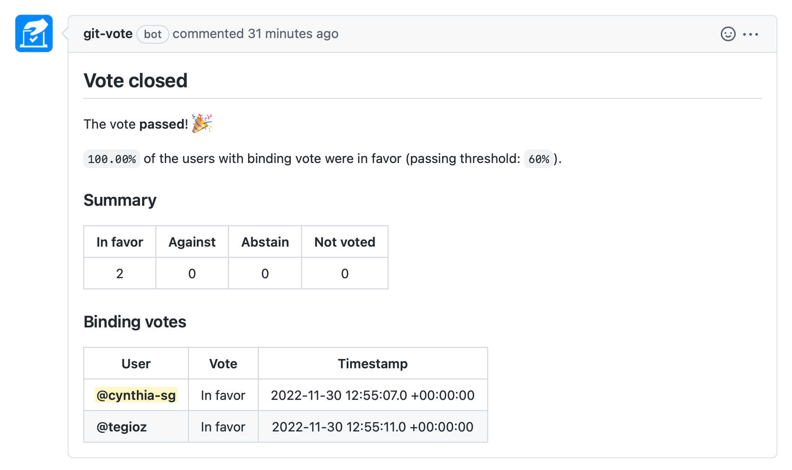

# GitVote

**GitVote** is a GitHub application that allows holding a vote on *issues* and *pull requests*.

## Usage

The first step is to install the **GitVote** application in the organization or repositories you'd like.

Once the application has been installed we can proceed with its configuration.

### Configuration

GitVote expects a configuration file named `.gitvote.yml` at the root of each repository where you'd like to create votes. Please note that the configuration file is **required** and no commands will be processed if it cannot be found.

```yaml
# GitVote configuration file
# This file must be located at the root of the repository

# Voters (required)
# List of GitHub usernames of the users who have binding votes
voters:
  - tegioz
  - cynthia-sg

# Pass threshold (required)
# Percentage of votes required to pass the vote
pass_threshold: 67

# Voting duration (required)
# How long the vote will be open
#
# Units supported (can be combined as in 1hour 30mins):
#
#   minutes | minute | mins | min | m
#   hours   | hour   | hrs  | hrs | h
#   days    | day    | d
#   weeks   | week   | w
#
duration: 5m
```

Once a vote is created, the configuration it will use during its lifetime will be the one present at the vote creation moment. This means that if we create a vote that lasts a week and, during that week another user is added to the list of authorized voters, they won't be able to participate in the vote already in progress. The same applies for changes in pass threshold, duration, etc.

### Creating votes

Votes can be created by adding a comment to an existent *issue* or *pull request* with the `vote` command:


*Please note that at the moment GitVote is not able to detect commands when a comment is edited, but only when it's created.*

Shortly after the comment with the `/vote` command is added, the vote will be created and the bot will post a new comment to the corresponding issue or pull request with the vote instructions.


### Voting

Users can cast their votes by reacting to the `git-vote` bot comment where the vote was created (screenshot above). It is possible to vote `in favor`, `against` or to `abstain`, and each of these options can be selected with the corresponding reaction:

| In favor | Against | Abstain |
| :------: | :-----: | :-----: |
|    👍     |    👎    |    👀    |

Only votes from users with a binding vote as defined in the configuration file will be counted.

*Please note that voting multiple options is not allowed and those votes won't be counted.*

### Closing votes

Once the vote time is up, the vote will be automatically closed and the results will be published in a new comment.


